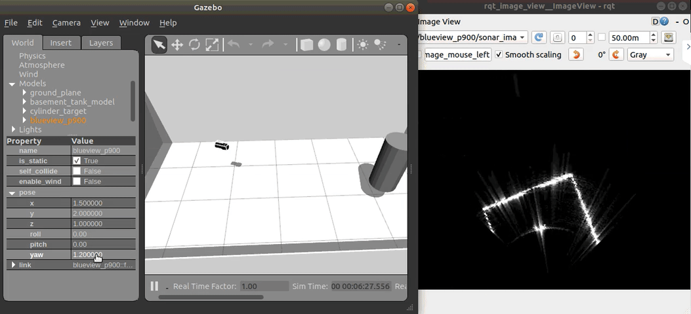

# Literature Review

## Introduction

Military forces are increasingly using autonomous Underwater Vehicles
(AUVs) to acquire high-resolution sonar imagery to detect mines and
other objects of interest on the seabed. Automatic detection and
classification techniques are being developed for several reasons: to
provide reliable and consistent detection of objects on the seabed, free
human analysts from time-consuming and tedious detection tasks, and
enable autonomous in-field decision-making based on observations of
mines and other objects. This document reviews progress in developing
automated detection and classification techniques for side-looking
sonars mounted on AUVs. Whilst the techniques have not yet reached
maturity, considerable progress has been made in both unsupervised and
supervised (trained) algorithms for feature detection and
classification. In some cases, the performance and reliability of
automated detection systems exceed those of human operators.

<figure id="fig:echo-sounder-location-australia" class="subfigures">

<figcaption>
Figure 1: Locations of echo-sounds data used for ocean
floor mapping near Australia (<a href="#ref-smith1996_ShipTrac"
role="doc-biblioref">Smith &amp; Sandwell, 1996</a>).

</figcaption>
</figure>

Acoustic devices are widely adopted for a systematic survey of the ocean
basin. For example, the ocean’s depth can usually be measured by
acoustic echosounders on ships or satellite altimeters data.

Oceanographic and naval ships have operated echo sounders almost
continuously while at sea, which facilitate millions of miles of
ship-track data recorded to produce maps. The tracks are not well
distributed and tend to cluster in regions that are high in traffic,
such as commercial shipping routes.
[Fig. 1](#fig:echo-sounder-location-australia) illustrates an example of
the echosounder data used for mapping the ocean floor near Australia.

### Structure

This literature is structured as follows. We will begin by covering some
background information about the principle in
[Sec. 1.2](#sec:background) and the typical usage of Sonar in underwater
vehicles. Then, in [Sec. 1.3.2](#sec:terminology) we provide a list of
common terminologies used in maritime application to familiarise the
readers on technical terms used throughout the article. In
[Sec. 1.4](#sec:technologies) we review several common types of sonar
technologies used in modern UAVs. We provide a review of sonar datasets
in [Sec. 1.7](#sec:dataset), followed by a brief description of several
commercial sonar data format in [Sec. 1.5](#sec:format). Then,
[Sec. 1.6](#sec:sim) provides a list of simulators that can simulate
sonar sensors and finish the article in [Sec. 1.8](#sec:ml) with a brief
review on the existing classification model for underwater operation.

## Background Information

Sonar (**SO**ound **N**avigation **A**nd **R**anging) and Radar
(**RA**dio **D**etection **A**nd **R**anging) are two systems that
operates under the same principle but with different types of wave. Both
systems are established to estimate the position of some foreign objects
using waves ([Altes, 1979](#ref-altes1979_TargPosi)). Sonar uses
ultrasound for detection underwater, whereas Radar uses radio waves for
above the land or underwater detection.

-   Sonar uses sound propagation for navigation, communication, or
    detecting objects under the water surface. The term “sonar” is
    shared by two different technologies—*passive sonar* and *active
    sonar*. [Fig. 2](#fig:passive-and-active-sonar) illustrates an
    overview between the two systems.

    -   **Passive Sonar** signal processing performs time delay
        estimation for naval systems ([Carter,
        1981](#ref-carter1981_TimeDela)). Signals received at two or
        more receiving sensors are used to estimate the position and
        velocity of some detected acoustic source. While a passive
        system has the advantage of covertness for military
        applications, its practicality is highly subjected to background
        noise as it cannot control the amount of transmitted energy
        reflected from the source. For example, Howell & Wood
        ([2003](#ref-howell2003_PassSona)) and De Seixas & De Moura
        ([2011](#ref-deseixas2011_PrepPass)) utilise sensor data
        retrieved from passive sonar systems for performing object
        detections with neural networks.

<figure id="fig:passive-and-active-sonar" class="subfigures">

<figcaption>
Figure 2: Passive and active sonar system (<a
href="#ref-kuperman2014_UndeAcou" role="doc-biblioref">Kuperman &amp;
Roux, 2014</a>). <strong>Passive:</strong> submarine (right)
passively detects sounds using a towed antenna array. The other
submarine will receive machine noise on the left (blue) and surface
shipping noise (red). These sounds are distorted by the shallow-water
environment and are embedded in ocean surface noise (green).
<strong>Active:</strong> ship on the right sends out a pulse (red) and
receives an echo (blue), regardless of machine noise, which is in turn
distorted by the shallow-water environment. The echo is returned to the
ship, which needs to be distinguished from backscattered reverberation
(yellow) and ocean noise (green). 
</figcaption>
</figure>

## Characteristic of Sonarr

### Variability of the Speed of Sound

The ocean’s acoustic properties mainly depend on the sound speed
structure, which depends on the oceanographic environment. When a sound
wave travels along a path from some localised source, the combination of
the water column and bottom properties leads to a set of
sound-propagation profiles ([Medwin et al.,
1999](#ref-medwin1999_FundAcou)). Sound speed profile in the ocean water
column has been experimentally derived ([Mackenzie,
1981](#ref-mackenzie1981_NineEqua); [Munk & Wunsch,
1998](#ref-munk1998_AbysReci)) as

1994   (1)

    $$ C = 1448.96 + 4.591T − 0.05304T^2 + 0.0002374T^ 3 + 0.0160Z + (1.340 − 0.01025 T)(S − 35) + 1.675 \times 10^{−7} Z^2 − 7.139 \times 10^{−13} T Z^3 $$

where *C* is the speed of sound in *m*/*s*, *T* is the temperature in
Celsius, *S* is salinity, and Z is depth in meters (which characterises
the ambient pressure). Note that the precise formulation details are not
of interest here in our scope. However,
[Eq. 1](#eq:speed-of-sound-profile) illustrates the nonlinear
relationship between the water temperature and the depth of the acoustic
device. In fact, the polynomial model illustrates up to a third-order
expression *wrt* *T* and *Z*. [Fig. 3](#fig:speed-profile) visualises
the same plotted data across ocean depth. For typical oceanic
conditions, *C* is usually between 1450 m/s and 1550 m/s, which reflects
the sensitivity of *C* to changes in temperature, depth, and salinity.
It is indicative that near-surface sonar devices will tend to experience
higher variance inaccuracy due to the polar region near the ocean
surface; the polar relationship decays as the depth increases. In a
warmer season, or warmer part of the day, the increased temperature
causes sound speed increases toward the sea surface (hence, the
influence of *C* is dominated by the temperature of the water); whereas
the pressure term in [Eq. 1](#eq:speed-of-sound-profile) is more
significant in deeper water. These are potential factors to be
considered in simulating sonar data for ML modelling, where the
environmental factors might be essential conditional features for our ML
model to learn.

<figure id="fig:speed-profile" class="subfigures">

<figcaption>
Figure 3: Generic sound-speed profiles vary directly with
temperature and hydrostatic pressure (<a href="#ref-kuperman2014_UndeAcou"
role="doc-biblioref">Kuperman &amp; Roux, 2014</a>). Near-surface
mixing leads to isovelocity (the gap in between the curves, which
denotes the polar region). 
</figcaption>
</figure>

### Terminology

-   Frequency:
    -   Different frequencies are typically used to map different water
        depths, with higher frequencies (&gt;100kHz) used for shallow
        water and low frequencies (&lt;30 kHz) for deepwater (see
        [Fig. 4](#fig:frequency-ocean-depth)).
    -   There is also a trade-off in resolution, with higher frequency
        shallow water systems providing greater spatial resolution than
        lower frequency deep-water systems
    -   Low-frequency (&lt;200kHz) Sonar has a long-range imaging
        capability. However, they are inherent in low resolution,
        reducing the ability to discriminate between smallscale
        features.
    -   Conversely, high-frequency (&gt;200kHz) imaging sonar generates
        high-resolution datasets, providing greater detail and improving
        data analysis ([Thurman et al.,
        2009](#ref-thurman2009_MultInte))
    -   The typical frequency usage at different depths are summarised
        in [Table 1](#tbl:sonar-frequency).

<figure id="fig:frequency-ocean-depth" class="subfigures">

<figcaption>
Figure 4: Classess of ocean depth, corresponds to <a
href="#tbl:sonar-frequency">Table 1</a>, (<a href="#ref-thurman2009_MultInte"
role="doc-biblioref">Thurman et al., 2009</a>). 
</figcaption>
</figure>

-   Resolution:

    -   Refers to the ability to distinguish between two closely spaced
        objects.
    -   A resolution cell is the minimum volume cell that can be seen by
        the Sonar separately from the surrounding features. An object
        might be represented as a single detected patch if the object is
        smaller than the cell’s resolution.
    -   The smaller the cells are, the better the resolution and the
        closer the sonar image is to reality.
    -   Cell size is defined by (i) Beam and (ii) Range Resolution.

-   Beam:

    -   A beam is a spatial and angular area where the acoustic energy
        is concentrated. As with a flashlight or projector, the beam is
        similar to a light cone.
    -   The angular size of the cone is usually referred to as the “beam
        width”, whereas the cross-section is often referred to as “beam
        footprint”

-   Range Resolution defines the resolution cell in 3D space, i.e.,
    resolution along the beam axis. The resolution, in turn, depends
    on (i) Ping Structure and (ii) Bandwidth.

    -   *Ping Structure*: includes the ping length (seconds), the
        central frequency (kHz) and the bandwidth (in kHz), unless the
        ping is a single-frequency (pure tonal) signal.
        -   The shorter the ping, the smaller the range resolution cell
            is (characterised by the central frequency).
    -   *bandwidth*: Generally, lower bandwidth provides better
        resolution. However, the Chirp spread spectrum can be used to
        modulate and obtain a better resolution than resolution.

-   *Attenuation*: the acoustic energy loss in the water. The longer the
    propagation path, the more energy is lost. A higher frequency will
    also induce more loss in the water medium.

-   *Multi-Path Propagation*: In shallow water, the sound is reflected
    by both the ocean bottom and surface.

    -   When operating an acoustic device over a sizeable horizontal
        range (much more significant than water depth), the echo can hit
        boundaries multiple times (known as *multi-bounce*) while
        propagating.
    -   The sound reflected by the target object can propagate in many
        different acoustic rays with different kinds of bounces, which
        makes it harder to analyse the target objects’ distance.
    -   The typical maximum horizontal range is at about 10 to 12 water
        depths.

<table>
<caption><em>Table 1</em>: Comparison of typical operating
specifications for sonar systems</caption>
<colgroup>
<col style="width: 16%" />
<col style="width: 8%" />
<col style="width: 16%" />
<col style="width: 10%" />
<col style="width: 10%" />
<col style="width: 38%" />
</colgroup>
<thead>
<tr class="header">
<th style="text-align: left;"></th>
<th style="text-align: left;">Water Depth</th>
<th style="text-align: left;">Operating Frequencies</th>
<th style="text-align: left;">Resolution</th>
<th style="text-align: left;">Swath Coverage</th>
<th style="text-align: left;">Remarks</th>
</tr>
</thead>
<tbody>
<tr class="odd">
<td style="text-align: left;">Shallow Water Systems</td>
<td style="text-align: left;">&lt; 100m</td>
<td style="text-align: left;">&gt; 200kHz</td>
<td style="text-align: left;">Medium - High</td>
<td style="text-align: left;">Low - Medium</td>
<td style="text-align: left;">Continental shelf, in shore-water seabed
surveying</td>
</tr>
<tr class="even">
<td style="text-align: left;">Deep Water Systems</td>
<td style="text-align: left;">&gt; 200m</td>
<td style="text-align: left;">&lt; 200kHz</td>
<td style="text-align: left;">Low</td>
<td style="text-align: left;">High</td>
<td style="text-align: left;">Wide-area, deep ocean seabed
surveying</td>
</tr>
<tr class="odd">
<td style="text-align: left;">ROV/AUV Systems</td>
<td style="text-align: left;">5m – 4000m</td>
<td style="text-align: left;">200kHz – 500kHz</td>
<td style="text-align: left;">High</td>
<td style="text-align: left;">Low</td>
<td style="text-align: left;">Detailed, high resolution seabed
surveying</td>
</tr>
</tbody>
</table>

*Table 1*: Comparison of typical operating specifications for sonar
systems

Other parts of the multi-beam system include auxiliary sensors such as
motion-sensing systems and Global Positioning Systems (GPS) to ensure
accurate positioning, motion sensing and sound speed measurement system.

A modern multi-beam sonar transducer typically uses the Mills Cross
array. The sound is transmitted from transducers that are perpendicular
to the survey track. Consequently, the sound pulses form a wide transmit
swath across and narrow along-track. The returning sound pulses, which
mainly record the impedance contrast and seafloor topography, are
received by the receivers mounted parallel to the survey track. These
return beams are narrow across the track. Unlike the sidescan Sonar,
which commonly produces only acoustic backscatter data (i.e. hardness),
the multi-beam Sonar generates both water depth and seafloor hardness
data concurrently. ([Geoscience Australia,
2014](#ref-geoscienceaustralia2014_MultSona)).

Optical vision provides high-resolution images for recognising
underwater environments with high accuracy in clear waters. However,
optical vision has a limitation in its visibilities, especially in
turbid or deep waters. Therefore, acoustic devices whose visibilities
are not heavily dependent on the depth of water and turbidness have high
reliability in the underwater environment.

-   Forward-Looking Sonar (FLS) imagery can be used for fish finding,
    scanning past objects, and differentiating between bottom structures
    and topography with high definition imagery for ship sailing.
    [Fig. 5](#fig:fls) illustrates a typical FLS device used in ships
    and the sonar output that such a device provides.

<figure id="fig:fls" class="subfigures">

 

<figcaption>
Figure 5: Forward-looking sonar (FLS) and example outputs
(<a
href="#ref-beaumont2021_ForwSona" role="doc-biblioref">Beaumont,
2021</a>). 
</figcaption>
</figure>

## Ascoustic and Sonar Technologies

High attenuation of electromagnetic waves underwater reduces the
usability of video or Radar in maritime applications in the subsea
environment. Instead, acoustic waves are typically the only practical
way to chart broad areas of the seafloor and its typological features.
Sonar technology has been successfully employed to record our ocean
seabeds’ composition, physical attributes, and habitat and community
patterns of the maritime ecosystem. In the following, we will
systematically list out and review the numerous acoustic devices
currently available. These systems differ in their acoustic mapping
techniques and capabilities.

### Single-beam echosounders (SBES)

Single-beam echosounders, also known as a depth sounder or fathometer,
releases a single sound pulse in a narrow beam and “listen” for the
return echo. The sonar ping is emitted from a transducer positioned
below the water surface, and the return echo might be reflected by
anything ranging from fish, debris, aquatic vegetation, suspended
sediment, or the ocean seafloor. SBES can be dated back to 1925 for the
first Fathometer (built by the Submarine Signal Company). They can be
relative portable nowadays as shown in
[Fig. 6](#fig:single-beam-echo-sounder-product)

<figure id="fig:single-beam-echo-sounder-product" class="subfigures">

<figcaption>
Figure 6: Single-beam echosounders as commercial products
for boats (<a
href="#ref-ceehydrosystemsSingBeam" role="doc-biblioref">CEE
HydroSystems, n.d.</a>). 
</figcaption>
</figure>

### Multi-Beam Sonars (MBS)

The Multi-Beam Sonars (MBS), or sometimes referred as Multibeam
echosounders (MBES), samples a region of the sea bottom by emitting
ultrasonic waves in an fan shape. The distance to the closest obstacles
within their field of view is obtained using Time of Flight (TOF)
techniques, thus computing the water depth. In contrast to other sonars,
directional information from the returning sound waves is extracted
using beamforming ([Van Veen & Buckley,
1988](#ref-vanveen1988_BeamVers)), so that a swath of depth readings is
obtained from every single ping. This behaviour constitutes the MBS main
advantage, as well as their most distinctive feature: contrarily to the
previously mentioned sonars, MBS provide true 3D information of the
ocean floor and, thus, they are commonly used to obtain subsea
bathymetry.

Multibeam Sonar is a standard offshore surveying tool that uses multiple
sound signals to detect seafloors (see [Fig. 7](#fig:multi-beam-sonar)).
The use of multiple beams allows it to map a swath of the seabed under
the ship (in contrast to a single beam sonar which only maps a single
point). Generally, the multi-beam sonar transducer is mounted rigidly to
the hull of the survey vessel, and its position can be calculated very
accurately ([Geoscience Australia,
2014](#ref-geoscienceaustralia2014_MultSona)). Compared to SBES,
Multibeam echosounder emits a multidirectional radial beam to obtain
information within a fan-shaped swath (see
[Fig. 7](#fig:multi-beam-sonar)), and they are typically used for bottom
profiling. The timing and direction of the returning sound waves provide
detailed information on the depth of water and any underwater features.
[Fig. 8](#fig:single-multibeam-echosunder) illustrates the qualitative
differences between collecting data with an SBES and MBES

<figure id="fig:multi-beam-sonar" class="subfigures">

<figcaption>
Figure 7: Multibeam sonar for seafloor mapping (<a
href="#ref-noaaphotolibrary2016_ArtiConc" role="doc-biblioref">NOAA
Photo Library, 2016</a>). 
</figcaption>
</figure>

-   **Multibeam echosunds mapping system (MBMS)** is an integration of
    several components: (i) the MBES, and (ii) an inertial navigation
    system (INS), (iii) a data-collection and (iv) a data-processing
    computer. Since MBES collects data by scanning the seafloor with
    multiple beams, the reconstructions of the mapping information
    require combining the collected depth information and the
    angles/timing at which the data are collected.

<figure id="fig:single-multibeam-echosunder" class="subfigures">

<figcaption>
Figure 8: Example of a single beam (top) and multi-beam
echosounder (bottom) output (<a href="#ref-usgs2018_HydrSurv"
role="doc-biblioref">USGS, 2018</a>). 
</figcaption>
</figure>

### Side Scan Sonar (SSS)

Side Scan Sonar (SSS) ([Sternlicht, 2017](#ref-sternlicht2017_HistDeve))
provides echo intensity profiles in the maritime environment ([Savini,
2011](#ref-savini2011_SideSona)). Spatial resolution of SSS is usually
below that of SAS and since they are not mounted on a rotating platform,
they do not provide 360◦ views of the environment but slices of the
seafloor ([Burguera & Oliver, 2016](#ref-burguera2016_HighUnde)).
Moreover, they do not provide true bathymetry like MBS. Despite these
limitations, when compared to SAS or MSIS, SSS are still the sensor of
choice to obtain seafloor imagery, and they will probably remain shortly
for two main reasons.

SSS are economical, thus being suitable even in low-cost robotics.
Moreover, they are particularly easy to deploy. They do not require any
special mounting such as MBS or MSIS and they are even available as a
towfish so they can be used without any additional infrastructure in
some AUV and Remotely Operated Vehicles (ROV), as well as in ships
([Fig. 9](#fig:SSS)). Also, their power consumption is below that of
SAS, MSIS and MBS, thus being well suited in underwater robotics where
the power tends to be a problem.

<figure id="fig:SSS" class="subfigures">

<figcaption>
Figure 9: Principle of a side-scan sonar mounted on an
autonomous underwater vehicle (<a href="#ref-lehoang2020_DeepGabo"
role="doc-biblioref">Le Hoang et al., 2020</a>).

</figcaption>
</figure>

The most common application of SSS is to produce acoustic images of the
sea bottom, which are analysed offline by humans. These images make it
possible to detect some geological features ([Johnson & Helferty,
1990](#ref-johnson1990_GeolInte)) or to explore and analyse
archaeological sites ([Bava-de-Camargo,
2015](#ref-bava-de-camargo2015_UseSide)), among others, but mainly
involving human analysis of the SSS data. Unfortunately, SSS imagery has
not been traditionally used to perform autonomous navigation since the
obtained acoustic images have some particularities that jeopardise their
automatic analysis.

For example, since SSS measurements are slices of the sea bottom usually
perpendicular to the motion direction, they do not overlap between them
and, thus, they provide no information to estimate the AUV motion
directly. Also, similarly to other sonars, SSS unevenly ensonify the
targets, thus leading to echoes that depend not only on the structure of
the sea bottom but also on the particular ensonification pattern.
Moreover, since the hydrophone and the ultrasonic emitter are very
close, the acoustic shadows, which correspond to occluded areas,
strongly depend on the AUV position concerning the target. This means
that the same target leads to very different acoustic images depending
on its position relative to the AUV. Finally, raw SSS images are
geometrically distorted representations of the sea bottom ([Cobra et
al., 1992](#ref-cobra1992_GeomDist)) and properly correcting this
distortion is a complex task ([Sheffer & Guterman,
2018](#ref-sheffer2018_GeomCorr)).

### Synthetic Aperture Sonar (SAS)

Synthetic Aperture Sonar (SAS) ([Edgar, 2011](#ref-edgar2011_IntrSynt))
gathers several measurements of each spot and fuses them during
post-processing, which producer high-resolution echo intensity profiles
([Fig. 10](#fig:sas-figure)). SAS is capable of scanning the sea bottom
with resolutions at the orders of magnitude better than other sonars
systems. However, using SAS constrains the maximum speed at which the
AUV can move since the same spot has to be observed several times.
Moreover, this high resolution depends on the AUV moving in straight
trajectories since observing the same spot from different angles may
jeopardise the post-processing. Moreover, SAS is particularly expensive,
and their deployment is more complex than other types of Sonar.

SAS is an enhancement from the standard, narrow beamwidth, sidescan
Sonar; capable of producing a more faithful, optical-like “image” of the
seafloor. The image intensity represents the backscattered acoustic
energy from a specific direction.

<figure id="fig:sas-figure" class="subfigures">

<figcaption>
Figure 10: With side scan sonar (left), each pulse
measures a distinct, separate area of the seafloor. In contrast, the
pulses of synthetic aperture sonar (right) overlap with each other and
measure each area more than once. This artificially lengthens the reach
of the array (<a
href="#ref-noaaExplTool" role="doc-biblioref">NOAA, n.d.</a>).

</figcaption>
</figure>

SAS’s image is an intensity representation of the backscattered acoustic
energy from a specific range, depression, and aspect angle. With a
standard side-looking sonar, each ping echo return is processed
independently and the main problem with the image is that the
along-track resolution (sometimes called azimuth resolution) becomes
poorer as the range increases. Synthetic aperture techniques use
coherent addition over many pings to create an aperture whose extent can
be increased with range to maintain a constant along-track resolution.

### Multi Aperture Sonar (MAS)

Multi Aperture Sonar (MAS) functions like a top-performing traditional
side-scan sonar, but it is processed very differently. MAS uses
multi-beam input from 32 elements to dynamically extend the focus along
the whole length of the swath. Using multiple apertures, the data is
further enhanced, and the Signal-to-noise Ratio is improved. Compared to
SAS, MAS addresses the AUV’s Weight And Power (SWAP) budget issues. MAS
draws only low 21 Watts (including data acquisition) – which makes it
equivalent to the class leading AUV side-scan sonars – but it offers a
range and accuracy like no other side-scan sonar. The precision of the
Sonar over the initial 50 meter swath is as stunning as the leading SAS
systems. At 75 meter range, the precision is better than two times that
of the closest side-scan Sonar ([Sonardyne,
2017](#ref-sonardyne2017_MASVs)).

<figure id="fig:MAS" class="subfigures">

<figcaption>
Figure 11: UUV Operators Collect New, Clear Images from
76-year-old Shipwreck with a Bluefin-12 equipped with Sonardyne Solstice
Multi Aperture Sonar at Sea Trials for the Royal Australian (<a
href="#ref-navyrecognition2020_SolsMult" role="doc-biblioref">Navy
Recognition, 2020</a>). 
</figcaption>
</figure>

### Mechanically Scanned Imaging Sonar (MSIS)

The most distinctive feature of Mechanically Scanned Imaging Sonar
(MSIS) ([Ribas et al., 2010](#ref-ribas2010_UndeMech)) is its rotating
sensing head which provides 360◦ echo intensity profiles of the
environment. Therefore, this sensor is used to detect and map obstacles
in the plane where the AUV navigates, though a few studies exist showing
their use to scan the sea bottom ([Sena, 2018](#ref-sena2018_ShalWate)).
The main drawback of this sensor is, precisely, the mechanical rotation,
which is responsible for very large scan times, usually between 10 and
20 seconds and also leads to high power consumption. This also
constrains the speed at which the AUV can move since moving at high
speed would lead to distorted scans. Additionally, installing an MSIS on
an AUV is not simple as they have a preferential mounting orientation.
[Fig. 12](#fig:msis-1) illustrates the typical device and
[Fig. 13](#fig:msis2) shows the visualisation of the sensor output.

<figure id="fig:msis-1" class="subfigures">

<figcaption>
Figure 12: Typical fan shaped beam used on scanning
sonars (<a
href="#ref-blueroboticsUndeUsin" role="doc-biblioref">Blue Robotics,
n.d.</a>). 
</figcaption>
</figure>

<figure id="fig:msis2" class="subfigures">

<figcaption>
Figure 13: Scanning process of an MSIS. (a) The two boxes
represent obstacles in the acoustic wave path; (b) Example of acoustic
image. The colors depict the echo intensities, ranging from blue (low
echo intensity) to red (high echo intensity). (<a href="#ref-burguera2012_UspIPerf"
role="doc-biblioref">Burguera et al., 2012</a>).

</figcaption>
</figure>

## Sonar file format

We are able to obtain some form of sonar data under the `.JSF` file
format from our defence partner. `.JSF` is a proprietary file format
developed by **EdgeTech** ([EdgeTech, 2006](#ref-edgetech2006_DescEdge))
for their manufactured sonar system. The [referenced
manual](https://www3.mbari.org/data/mbsystem/formatdoc/JSF_format_Rev17.pdf)
contains the specification of how to parses the binary format. However,
the file format does not seem widespread among AUV systems (or perhaps
the question should likely be whether there is a standardised format at
all).

Specialised software can render the captured sonar scans into a 3D
format with meshing, for example, ([SonarWiz,
n.d.-a](#ref-sonarwizEdgeJSF)) and ([Moga Software,
n.d.](#ref-mogasoftwareSeaVMOSA)). However, both options require a
commercial license to operate. We also found some legacy software
([DeepVision, n.d.](#ref-deepvisionSonaSoft)) from 2010 that had failed
to install,

Some open-source software can also perform some limited preliminary
reads on `JSF` files. For example, [this
package](https://github.com/Geosvy/jsfmesgtype) ([O’Brien,
2019](#ref-obrien2019_Geos)) enable users to count the number of
messages types within the `JSF` container, and
[this](https://github.com/Geosvy/lstjsf) ([O’Brien,
2018](#ref-obrien2018_Geos)) allows the user to list the contents of an
Edgetech Sonar data file. However, the capability to reconstruct the
scene remains only available in commercial products.

### Types of existing format

Unfortunately, there does not seem to have any open standard format for
recording sonar data. Vendors seem to develop their proprietary form of
format whenever they put resources into developing their sonar devices.
Based on an indirect source of information from SonarWiz ([SonarWiz,
n.d.-b](#ref-sonarwizSonaSide)) (a software for post-processing survey
data), they claimed that their software could support more than 25
formats, where each format belongs to some Manufacture.
[Table 2](#tbl:sonarwiz-supported) list out all Sidescan Sonar Data file
formats supported by the software, along with their corresponding
manufacturer (`JSF` is only one type of format out of the bigger
picture) ([*Sidescan Sonar Data Formats*, n.d.](#ref-SideSona)).

<table>
<caption><em>Table 2</em>: Comparison of typical operating
specifications for sonar systems</caption>
<thead>
<tr class="header">
<th>Manufacturer / Format Name</th>
<th>Format Extension</th>
</tr>
</thead>
<tbody>
<tr class="odd">
<td>C-MAX</td>
<td>XTF, CM2</td>
</tr>
<tr class="even">
<td>CODA</td>
<td>COD</td>
</tr>
<tr class="odd">
<td>Edgetech</td>
<td>JSF</td>
</tr>
<tr class="even">
<td>eXtended Triton Format</td>
<td>XTF</td>
</tr>
<tr class="odd">
<td>Geoacoustics</td>
<td>GCF, RDF, RFF</td>
</tr>
<tr class="even">
<td>Humminbird side-view</td>
<td>DAT</td>
</tr>
<tr class="odd">
<td>HYPACK</td>
<td>HSX</td>
</tr>
<tr class="even">
<td>Imagenix Sportscan</td>
<td>81S</td>
</tr>
<tr class="odd">
<td>Imagenix Yellowfin</td>
<td>872</td>
</tr>
<tr class="even">
<td>Imagenix Delta T Backscatter</td>
<td>83P</td>
</tr>
<tr class="odd">
<td>Innomar SS</td>
<td>SES</td>
</tr>
<tr class="even">
<td>Klein</td>
<td>SDF</td>
</tr>
<tr class="odd">
<td>Kongsberg EM backscatter</td>
<td>ALL, KMALL</td>
</tr>
<tr class="even">
<td>Kongsberg (Simrad) EA400/600 Backscatter</td>
<td>RAW</td>
</tr>
<tr class="odd">
<td>Kongsberg (ProSAS, HI SAS 1030)</td>
<td>IMG, XTF</td>
</tr>
<tr class="even">
<td>Kongsberg (PULSAR SS)</td>
<td>XTF, SMB</td>
</tr>
<tr class="odd">
<td>KRAKEN</td>
<td>TIL</td>
</tr>
<tr class="even">
<td>Lowrance</td>
<td>XTF, SL2, SL3</td>
</tr>
<tr class="odd">
<td>Marine Sonic</td>
<td>MST, SDS</td>
</tr>
<tr class="even">
<td>MCM Sensor HD</td>
<td>H5</td>
</tr>
<tr class="odd">
<td>QMips</td>
<td>DAT, QMP</td>
</tr>
<tr class="even">
<td>QPS</td>
<td>QPD, DB</td>
</tr>
<tr class="odd">
<td>R2Sonic</td>
<td>R2S, XTF</td>
</tr>
<tr class="even">
<td>RESON</td>
<td>S7K</td>
</tr>
<tr class="odd">
<td>Seabeam2100 (MBSystem)</td>
<td>MB41</td>
</tr>
<tr class="even">
<td>Sonardyne Solstice</td>
<td>SWF8</td>
</tr>
<tr class="odd">
<td>SwathPlus (Bathyswath)</td>
<td>SXR, SXP</td>
</tr>
<tr class="even">
<td>Swedish Geo Survey</td>
<td>SEG, SGY</td>
</tr>
<tr class="odd">
<td>Tritech</td>
<td>V4Log, LogDoc, XTF</td>
</tr>
</tbody>
</table>

*Table 2*: Comparison of typical operating specifications for sonar
systems

## Sonar visualisation and simulation

Rômulo Cerqueira et al. ([2016](#ref-cerqueira2016_CustShad)) implements
custom shaders for efficient Sonar simulation. The underwater sonar
sensors are simulated by vertex and fragment processing, composed of the
integration between the Gazebo simulator and the Robot Construction Kit
(ROCK) framework. They can be used for virtual acoustic images from a
**mechanical scanning sonar** and **forward-looking sonar** simulations.

<figure id="fig:gazebo-cerqueira2016_CustShad" class="subfigures">

<figcaption>
Figure 14: Gazebo simulator with custom shaders (<a
href="#ref-cerqueira2016_CustShad" role="doc-biblioref">Rômulo Cerqueira
et al., 2016</a>). 
</figcaption>
</figure>

Nikolov et al. ([1997](#ref-nikolov1997_Inte3D)) describe a new software
system for interactive three-dimensional visualisation of sonar data.
Novel approaches to 3-D volumetric sonar data reconstruction and
segmentation are presented. VRML worlds are generated from the segmented
data with the aim of quick and interactive 3-D visualisation and
interpretation of the sea.

<figure id="fig:3D-vis" class="subfigures">

<figcaption>
Figure 15: 3-D segmentation, surface extraction, texture
mapping and data fusion (<a href="#ref-nikolov1997_Inte3D"
role="doc-biblioref">Nikolov et al., 1997</a>). 
</figcaption>
</figure>

Kwak et al. ([2015](#ref-kwak2015_DeveAcou)) proposed a principles of
acoustic natures and imaging geometry model of the acoustic camera which
greatly contribute to developing a simulator for the acoustic images
([Fig. 16](#fig:kwak2015_DeveAcou-vis)). The technique can generate
realistic virtual acoustic images based on the proposed principles.

<figure id="fig:kwak2015_DeveAcou-vis" class="subfigures">

<figcaption>
Figure 16: Comparison of acoustic images and optical
images: (a) acoustic image of cone, (b) acoustic image of cylinder, (c)
optical image of cone, and (d) optical image of cylinder (<a
href="#ref-kwak2015_DeveAcou" role="doc-biblioref">Kwak et al.,
2015</a>). 
</figcaption>
</figure>

### Existing packages for sonar simulation

-   [MOOS](https://sites.google.com/site/moossoftware/): MOOS stands for
    “Mission Oriented Operating Suite” and its original use was for the
    Bluefin Odyssey III vehicle owned by MIT ([Newman,
    2008](#ref-newman2008_MOOSMiss)). MOOS is an autonomy middleware
    that implies that it is a glue that connects a collection of
    applications. MOOS can be used to generate scans such as the one
    used in [Fig. 17](#fig:moos-acfr) from the ACFR group ([Anderson,
    2015](#ref-anderson2015_SimuSide)).

-   [MOOS-IvP](https://oceanai.mit.edu/moos-ivp/pmwiki/pmwiki.php?n=Main.HomePage):
    According to MOOS-IvP’s
    [manual](https://oceanai.mit.edu/moos-ivp-pdf/moosivp-helm.pdf)
    ([Benjamin et al., n.d.](#ref-benjaminOverMOOS)), MOOS-IvP is an
    improved framework based upon MOOS, where the IvP Helm is a single
    MOOS process theat uses multi-objective optimisation to implement
    behaviour coordination. The IvP refers to “Interval Programming,”
    the core mathematical concept for performing multi-objective
    optimisation.

-   [MOOS-ROS-bridge](https://github.com/SyllogismRXS/moos-ros-bridge):
    ([DeMarco, 2021](#ref-demarco2021_Moos)) ROS is a more sophisticated
    framework for robotics application; however, MOSS is a more
    specialised middleware for maritime application ([DeMarco et al.,
    2011](#ref-demarco2011_ImplROS)). This package enables user to
    create a communication bridge between the two.

-   [Sonar-simulator-blender](https://github.com/sollynoay/Sonar-simulator-blender):
    A 2D forward looking sonar simulator built in Blender. It can
    generates acoustic image via a backscattered intensity image and a
    depth image.

<figure id="fig:moos-acfr" class="subfigures">

<figcaption>
Figure 17: MOOS virualisation tool (<a href="#ref-anderson2015_SimuSide"
role="doc-biblioref">Anderson, 2015</a>). 
</figcaption>
</figure>

-   [Imaging sonar
    simulator](https://github.com/romulogcerqueira/sonar_simulation):
    This repository contains the build system of imaging sonar
    simulator + partly data ([Romulo Cerqueira et al.,
    n.d.](#ref-cerqueiraCustShad); [Rômulo Cerqueira et al.,
    2020](#ref-cerqueira2020_RastRayt)), for:
    -   Mechanical scanning imaging sonar (MSIS)
    -   Forward-looking sonar (FLS)
-   [UUV Simulator](https://github.com/uuvsimulator/): Manhães et al.
    ([2016](#ref-manhaes2016_UUVSimu)) introduces an Unmanned Underwater
    Vehicle (UUV) Simulator, as an extension of the open-source robotics
    simulator Gazebo to underwater scenarios, that can simulate multiple
    underwater robots and intervention tasks using robotic manipulators.
    The simulator implements a set of newly implemented plugins that
    model underwater hydrostatic and hydrodynamic effects, thrusters,
    sensors, and external disturbances ([Fig. 18](#fig:UUV-sim)). In
    contrast to existing solutions, it reuses and extends a
    general-purpose robotics simulation platform to underwater
    environments. [Link](https://uuvsimulator.github.io/)

<figure id="fig:UUV-sim" class="subfigures">

<figcaption>
Figure 18: UUV Simulator - Software structure (<a
href="#ref-manhaes2016_UUVSimu" role="doc-biblioref">Manhães et al.,
2016</a>). 
</figcaption>
</figure>

-   [Waterloo-Aquadrone](https://github.com/Waterloo-Aquadrone/aquadrone-core/):
    Waterloo Aquadrone ([2021](#ref-waterlooaquadrone2021_Aqua2020)), a
    team from Waterloo Aquadrone, releases a workspace for developing a
    fully autonomous submarine.

-   [Inpinite Studio](https://infinitestudio.software/) is a using
    unreal engine for performing multispectral simulations. The software
    allows users to customise the modelling properties; for example,
    materials are defined using actual data for spectral reflectivity,
    emissivity, transmission, and roughness. In-band thermal emissions
    can be evaluated by spectral integration. It currently supports
    lighting, transmissions and secondary effects from refections.
    Qualitative evaluation of the simulated results can be performed by
    comparing them against experimental results that we would expect
    from physical scenarios. [Fig. 19](#fig:infinite-studio) illustrates
    the interface of the infinite studio within unreal engine’s
    software.

<figure id="fig:infinite-studio" class="subfigures">

<figcaption>
Figure 19: Inpinite Studio’s interfacs. 
</figcaption>
</figure>

-   [Dave](https://github.com/Field-Robotics-Lab/dave/): Dave is a
    simulation environment to support the rapid testing and evaluation
    of underwater robotic solutions, specifically underwater vehicles
    (AUVs/UUVs). @Manhães et al. ([2016](#ref-manhaes2016_UUVSimu))
    presents a physics-based multi-beam echosounder simulation method to
    capture these fundamental aspects of sonar perception. A point-based
    scattering model is implemented to calculate the acoustic
    interaction between the target and the environment
    [Fig. 20](#fig:dave). This simplified target scattering
    representation but can produce realistic coherent image speckle and
    the correct point spread function. The results demonstrate that this
    multi-beam echosounder simulator generates qualitatively realistic
    images with high efficiency to provide the sonar image and the
    physical time-series signal data.

<figure id="fig:dave" class="subfigures">

<figcaption>
Figure 20: Operating with the Dave Simulator (<a
href="#ref-field-robotics-labMultForw"
role="doc-biblioref">Field-Robotics-Lab, n.d.</a>).

</figcaption>
</figure>

## Maritime Dataset

-   Mallios et al. ([2017](#ref-mallios2017_UndeCave)) seems to be a
    high-quality underwater cave dataset published recently in The
    International Journal of Robotic Research on Underwater caves sonar
    data set. The dataset features a collection from an autonomous
    underwater vehicle testbed in the unstructured environment of an
    underwater cave complex. The dataset contains a packaged ROS bag
    (Robotic Operation System) and human-readable text files. The UAV
    contains multiple sensors such as 3D gyroscopes, accelerometers, 10
    degrees of freedom MEMS inertial sensor, a Doppler velocity log,
    etc. The perception sensors include a mechanically scanned imaging
    sonar (MSIS), a dual-frequency profiling sonar, and a low-cost
    analog video camera. [Fig. 21](#fig:ijrr-dataset) illustrate the UAV
    and its survey location; the dataset is available
    [here](https://cirs.udg.edu/caves-dataset/).

<figure id="fig:ijrr-dataset" class="subfigures">

 

<figcaption>
Figure 21: Underwater cave dataset: UAV model and its
survey location (<a href="#ref-mallios2017_UndeCave"
role="doc-biblioref">Mallios et al., 2017</a>). 
</figcaption>
</figure>

## Underwater Classification

Detection/ classification routines can broadly be divided into two
kinds: the operation of supervised and unsupervised algorithms.
Supervised algorithms can be trained for the required detection task
using images representing the clutter backgrounds likely to be
encountered, providing flexibility to cope with both straightforward and
difficult detection tasks ([Chapple, n.d.](#ref-chappleAutoDete)).
Supervised algorithms require training data to set up their operation;
unsupervised algOrithms do not.

While supervised algorithms can be expected to perform better when there
is a training data set appropriate for the test data (the data in which
unknown mines must be detected), the task of obtaining an appropriate
training data set is non-trivial. There must be mine-like objects in
known locations, so that valid detections and false alarms can be
identified, and the background clutter and reverberations should be
typical and representative of those in the test data. There should also
be enough training data so that anomalies in particular training images
do not affect the overall detection performance. Training with data sets
including atypical backgrounds and reverberations can impair the
performance of a trained algorithm; it is better to restrict the
training data to contain only typical backgrounds and representative of
those encountered in the detection task at hand.

<figure id="fig:data-preprocess" class="subfigures">

<figcaption>
Figure 22: Example of intensity and slant corrected
acoustic image. The blind zone and the central bins, separating port and
starboard, are outlined. The blind and low contrast zones under constant
altitude and flat floor assumptions are also shown. (<a
href="#ref-burguera2020_OnLiMult" role="doc-biblioref">Burguera &amp;
Bonin-Font, 2020</a>). 
</figcaption>
</figure>

Burguera & Bonin-Font ([2020](#ref-burguera2020_OnLiMult)) proposed an
online multi-class segmentation for side-scan sonar acoustic data for
building a semantic map of the sea bottom for SLAM. The authors first
propose an architecture of pre-processing the input data
([Fig. 22](#fig:data-preprocess)). Then, a data segmentation procedure
is then applied to the processed data to detect the existing terrain
types. They propose to perform online SSS segmentation based on a CNN
with a sliding window, with the CNN architecture as shown in
[Fig. 23](#fig:sonar-cnn-seg), and the data-processing step shown in
[Fig. 24](#fig:data-seg-processing-step).

<figure id="fig:sonar-cnn-seg" class="subfigures">

<figcaption>
Figure 23: Neural Network architecture (<a
href="#ref-burguera2020_OnLiMult" role="doc-biblioref">Burguera &amp;
Bonin-Font, 2020</a>). 
</figcaption>
</figure>

<figure id="fig:data-seg-processing-step" class="subfigures">

<figcaption>
Figure 24: Example of data processing. (a,b): Modelled
echo intensity E(p) according to Equation (5). (c,d): Raw SSS data.
(e,f): Intensity and slant corrected acoustic image. (<a
href="#ref-burguera2020_OnLiMult" role="doc-biblioref">Burguera &amp;
Bonin-Font, 2020</a>). 
</figcaption>
</figure>

Karimanzira et al. ([2020](#ref-karimanzira2020_ObjeDete)) developed a
generalised underwater object detection solution based on Automated
Machine Learning with R-CNN. The trained simple object detector was then
used for automatic data collection and annotating a large dataset.
[Fig. 25](#fig:auto-annotate) is some predictions from the primitive
model, which illustrate the benefits of the methodology for automated
data annotation.

<figure id="fig:auto-annotate" class="subfigures">

<figcaption>
Figure 25: In (a) two annotations are correctly
suggested, and one is missed, which should be labelled manually. In (b)
this image would take a long time to annotate manually. The primitive
model has done a reasonable job of cutting out the bulk of the workload
(<a
href="#ref-karimanzira2020_ObjeDete" role="doc-biblioref">Karimanzira et
al., 2020</a>). 
</figcaption>
</figure>

Hurtos et al. ([2013](#ref-hurtos2013_AutoDete)) proposed a framework
for automatic chain detection in underwater environment
([Fig. 26](#fig:chain-detection)). The automatic chain link detection
from Forward-Looking Sonar (FLS) imagery reduces the signal-to-noise
ratio of the individual sonar frames, and cluster the local detections
over time to increase robustness ([Fig. 27](#fig:chain-detection-2)).

<figure id="fig:chain-detection" class="subfigures">

<figcaption>
Figure 26: Schematic of the link detection algorithm
(<a
href="#ref-hurtos2013_AutoDete" role="doc-biblioref">Hurtos et al.,
2013</a>). 
</figcaption>
</figure>

<figure id="fig:chain-detection-2" class="subfigures">

<figcaption>
Figure 27: Example of established clusters (circled in
white) after the accumulation of detections over a buffer of 9 images
(<a
href="#ref-hurtos2013_AutoDete" role="doc-biblioref">Hurtos et al.,
2013</a>). 
</figcaption>
</figure>

## References

Altes, R. A. (1979). Target position estimation in radar and sonar, and
generalized ambiguity analysis for maximum likelihood parameter
estimation. *Proceedings of the IEEE*, *67*(6), 920–930.
<https://doi.org/dxdc7v>

Anderson, T. (2015). *Simulating Side Scan Sonar as a MOOS app using
NVIDIA OptiX*. 24.

Bava-de-Camargo, P. F. (2015). The use of side scan sonar in Brazilian
Underwater Archaeology. *2015 IEEE/OES Acoustics in Underwater
Geosciences Symposium (RIO Acoustics)*, 1–7. <https://doi.org/gpb94j>

Beaumont, D. (2021). Forward-looking sonars. In *Ocean Sailor Magazine*.
<https://oceansailormagazine.com/forward-looking-sonars/>

Benjamin, M. R., Schmidt, H., & Newman, P. (n.d.). *An Overview of
MOOS-IvP and a Users Guide to the IvP Helm - Release 19.8*. 372.

Blue Robotics. (n.d.). Understanding and Using Scanning Sonars. In *Blue
Robotics*. Retrieved February 3, 2022, from
<https://bluerobotics.com/learn/understanding-and-using-scanning-sonars/>

Burguera, A., & Bonin-Font, F. (2020). On-Line Multi-Class Segmentation
of Side-Scan Sonar Imagery Using an Autonomous Underwater Vehicle.
*Journal of Marine Science and Engineering*, *8*(8), 557.
<https://doi.org/gpbh84>

Burguera, A., Cid, Y., & Oliver, G. (2012). The UspIC: Performing Scan
Matching Localization Using an Imaging Sonar. *Sensors (Basel,
Switzerland)*, *12*, 7855–7885. <https://doi.org/gcfmbk>

Burguera, A., & Oliver, G. (2016). High-resolution underwater mapping
using side-scan sonar. *PloS One*, *11*(1), e0146396.
<https://doi.org/f8qbpd>

Carter, G. (1981). Time delay estimation for passive sonar signal
processing. *IEEE Transactions on Acoustics, Speech, and Signal
Processing*, *29*(3), 463–470. <https://doi.org/d2txr2>

CEE HydroSystems. (n.d.). *Single Beam Echo Sounders:
Ultra-rugged compact single beam echo
sounder survey systems*. Retrieved January 28, 2022, from
<https://ceehydrosystems.com/products/single-beam-echo-sounders/>

Cerqueira, Rômulo, Trocoli, T., Albiez, J., & Oliveira, L. (2020). A
rasterized ray-tracer pipeline for real-time, multi-device sonar
simulation. *Graphical Models*, *111*, 101086. <https://doi.org/gpcbh7>

Cerqueira, Romulo, Trocoli, T., Neves, G., Oliveira, L., Joyeux, S., &
Albiez, J. (n.d.). *Custom Shader and 3D Rendering for computationally
efficient Sonar Simulation*. 4.

Cerqueira, Rômulo, Trocoli, T., Neves, G., Oliveira, L., Joyeux, S.,
Albiez, J., & Center, R. I. (2016). Custom shader and 3d rendering for
computationally efficient sonar simulation. *29th Conference on
Graphics, Patterns and Images-SIBGRAPI*.

Chapple, P. (n.d.). *Automated Detection and Classification in
High-resolution Sonar Imagery for Autonomous
Underwater Vehicle Operations*. 37.

Cobra, D. T., Oppenheim, A. V., & Jaffe, J. S. (1992). Geometric
distortions in side-scan sonar images: A procedure for their estimation
and correction. *IEEE Journal of Oceanic Engineering*, *17*(3), 252–268.
<https://doi.org/cb53n7>

De Seixas, J. M., & De Moura, N. N. (2011). Preprocessing passive sonar
signals for neural classification. *IET Radar, Sonar & Navigation*,
*5*(6), 605–612. <https://doi.org/dbm6dm>

DeepVision. (n.d.). *Sonar Software | DeepVision*. Retrieved January 31,
2022, from <https://deepvision.se/download/sonar-software/>

DeMarco, K. (2021). *Moos-ros-bridge*.
<https://github.com/SyllogismRXS/moos-ros-bridge>

DeMarco, K., West, M. E., & Collins, T. R. (2011). An implementation of
ROS on the Yellowfin autonomous underwater vehicle (AUV). *OCEANS’11
MTS/IEEE KONA*, 1–7. <https://doi.org/gpbpqq>

Edgar, R. (2011). Introduction to Synthetic Aperture Sonar. *Sonar
Systems*, 1–11.

EdgeTech. (2006). *Description of the Edgetech (.jsf) File Format*.
<https://www3.mbari.org/data/mbsystem/formatdoc/JSF_format_Rev17.pdf>

Field-Robotics-Lab. (n.d.). Multibeam Forward Looking Sonar ⋅
Field-Robotics-Lab/dave Wiki. In *GitHub*. Retrieved February 3, 2022,
from <https://github.com/Field-Robotics-Lab/dave>

Geoscience Australia. (2014). *Multibeam sonar*.
<https://www.ga.gov.au/scientific-topics/marine/survey-techniques/sonar/multibeam-sonar>

Howell, B. P., & Wood, S. (2003). Passive sonar recognition and analysis
using hybrid neural networks. *Oceans 2003. Celebrating the Past ...
Teaming Toward the Future (IEEE Cat. No.03CH37492)*, *4*, 1917–1924
Vol.4. <https://doi.org/bgw7fn>

Hurtos, N., Palomeras, N., Nagappa, S., & Salvi, J. (2013). Automatic
detection of underwater chain links using a forward-looking sonar. *2013
MTS/IEEE OCEANS - Bergen*, 1–7. <https://doi.org/gn9xgd>

Johnson, H. P., & Helferty, M. (1990). The geological interpretation of
side-scan sonar. *Reviews of Geophysics*, *28*(4), 357–380.
<https://doi.org/fsmfdt>

Karimanzira, D., Renkewitz, H., Shea, D., & Albiez, J. (2020). Object
detection in sonar images. *Electronics*, *9*(7), 1180.
<https://doi.org/gpcbkn>

Kuperman, W. A., & Roux, P. (2014). Underwater Acoustics. In T. D.
Rossing (Ed.), *Springer Handbook of Acoustics* (pp. 157–212). Springer.
<https://doi.org/10.1007/978-1-4939-0755-7_5>

Kwak, S., Ji, Y., Yamashita, A., & Asama, H. (2015). Development of
acoustic camera-imaging simulator based on novel model. *2015 IEEE 15th
International Conference on Environment and Electrical Engineering
(EEEIC)*, 1719–1724. <https://doi.org/gpcdgw>

Le Hoang, T., Phung, S., Chapple, P., Bouzerdoum, A., Ritz, C., & Tran,
L. C. (2020). Deep Gabor Neural Network for Automatic Detection of
Mine-Like Objects in Sonar Imagery. *IEEE Access*, *PP*, 1–1.
<https://doi.org/gpb94t>

Mackenzie, K. V. (1981). Nine-term equation for sound speed in the
oceans. *The Journal of the Acoustical Society of America*, *70*(3),
807–812. <https://doi.org/d56265>

Mallios, A., Vidal, E., Campos, R., & Carreras, M. (2017). Underwater
caves sonar data set. *The International Journal of Robotics Research*,
*36*(12), 1247–1251. <https://doi.org/gcjf9m>

Manhães, M. M. M., Scherer, S. A., Voss, M., Douat, L. R., &
Rauschenbach, T. (2016). UUV Simulator: A
Gazebo-based package for underwater intervention and multi-robot
simulation. *OCEANS 2016 MTS/IEEE Monterey*, 1–8.
<https://doi.org/gf7nz9>

Medwin, H., Clay, C. S., & Stanton, T. K. (1999). *Fundamentals of
acoustical oceanography*. Acoustical Society of America.

Moga Software. (n.d.). *SeaView MOSAIC*. Retrieved January 31, 2022,
from <https://www.mogasw.com/seaview/mosaic/>

Munk, W., & Wunsch, C. (1998). Abyssal recipes II: Energetics of tidal
and wind mixing. *Deep Sea Research Part I: Oceanographic Research
Papers*, *45*(12), 1977–2010. <https://doi.org/bt7s3f>

Navy Recognition. (2020). Solstice multi-aperture sonar has been
integrated into mine warfare command software used by Australian Navy.
In *Navy Recognition*.
<https://www.navyrecognition.com/index.php/naval-news/naval-news-archive/2020/september/8992-solstice-multi-aperture-sonar-has-been-integrated-into-mine-warfare-command-software-used-australian-navy.html>

Newman, P. (2008). MOOS - Mission Orientated Operating Suite.
*Undefined*.
<https://www.semanticscholar.org/paper/MOOS-Mission-Orientated-Operating-Suite-Newman/5abb6be8b008d898f6aec4d76f3eefb26a905c7b>

Nikolov, S., Loke, E., & du Buf, J. (1997). *Interactive 3-D
Visualisation of Sonar Data Using VRML*.

NOAA. (n.d.). *Exploration Tools: Synthetic Aperture Sonar: NOAA Office
of Ocean Exploration and Research*. Retrieved February 3, 2022, from
<https://oceanexplorer.noaa.gov/technology/sonar/sas.html>

NOAA Photo Library. (2016). *Artist’s conception of multibeam sonar on
NOAA Ship NANCY FOSTER*.
<https://www.flickr.com/photos/noaaphotolib/27555144884/>

O’Brien, T. (2018). *Geosvy/lstjsf*. <https://github.com/Geosvy/lstjsf>

O’Brien, T. (2019). *Geosvy/jsfmesgtype*.
<https://github.com/Geosvy/jsfmesgtype>

Ribas, D., Ridao, P., & Neira, J. (2010). Understanding mechanically
scanned imaging sonars. In *Underwater SLAM for Structured Environments
Using an Imaging Sonar* (pp. 37–46). Springer.

Savini, A. (2011). Side-scan sonar as a tool for seafloor imagery:
Examples from the Mediterranean Continental Margin. *Sonar Systems*.
<https://doi.org/gpb94d>

Sena, A. L. S. (2018). *Shallow water remote sensing using sonar
improved with geostatistics and stochastic resonance data processing*
\[PhD thesis\]. Universitat de les Illes Balears.

Sheffer, T., & Guterman, H. (2018). Geometrical Correction of
Side-scan Sonar Images. *2018 IEEE
International Conference on the Science of Electrical Engineering in
Israel (ICSEE)*, 1–5. <https://doi.org/gpb94p>

*Sidescan Sonar Data Formats*. (n.d.). Retrieved January 31, 2022, from
<https://chesapeaketech.com/wp-content/uploads/docs/SonarWiz7_UG/HTML/cheasapeaketech.com/sidescan_sonar_data_formats.htm>

Smith, W. H. F., & Sandwell, D. T. (1996). *Ship Tracks*. Version.

Sonardyne. (2017). MAS vs SAS - When should we use multiple aperture
sonar? In *Sonardyne*.
<https://www.sonardyne.com/mas-vs-sas-when-should-we-use-multiple-aperture-sonar/>

SonarWiz. (n.d.-a). *EdgeTech JSF Import Options*. Retrieved January 31,
2022, from
<https://chesapeaketech.com/wp-content/uploads/docs/SonarWiz7_UG/HTML/cheasapeaketech.com/edgetech_jsf_import_options.htm>

SonarWiz. (n.d.-b). *SonarWiz - Sidescan Sonar Mapping & Post-Processing
| Chesapeake Technology*. Retrieved January 31, 2022, from
<https://chesapeaketech.com/products/sonarwiz-sidescan/>

Sternlicht, D. D. (2017). Historical development of side scan sonar.
*The Journal of the Acoustical Society of America*, *141*(5), 4041–4041.
<https://doi.org/gpb94c>

Thurman, E., Riordan, J., & Toal, D. (2009). *Multi-Sonar Integration
and the Advent of Senor Intelligence*. <https://doi.org/10.5772/39412>

USGS. (2018). *Hydrographic Surveys of Rivers and Lakes Using a
Multibeam Echosounder Mapping System* (Fact Sheet) \[Fact {{Sheet}}\].

Van Veen, B. D., & Buckley, K. M. (1988). Beamforming: A versatile
approach to spatial filtering. *IEEE Assp Magazine*, *5*(2), 4–24.
<https://doi.org/fv5wnm>

Waterloo Aquadrone. (2021). *Aquadrone 2020*. Waterloo Aquadrone.
<https://github.com/Waterloo-Aquadrone/aquadrone-core>
