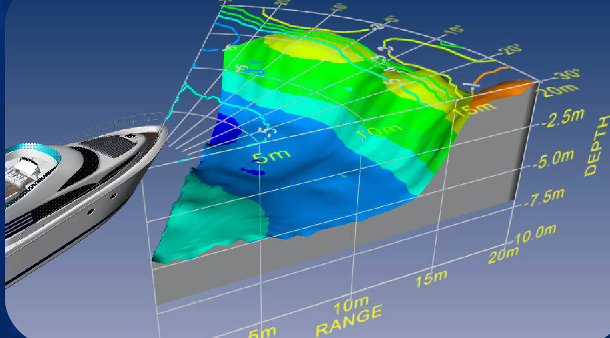
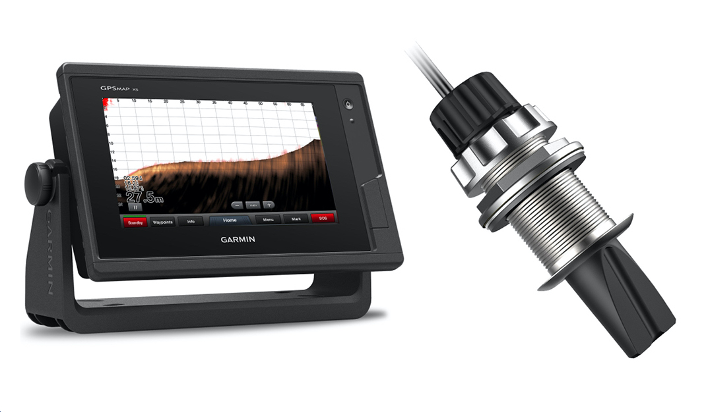
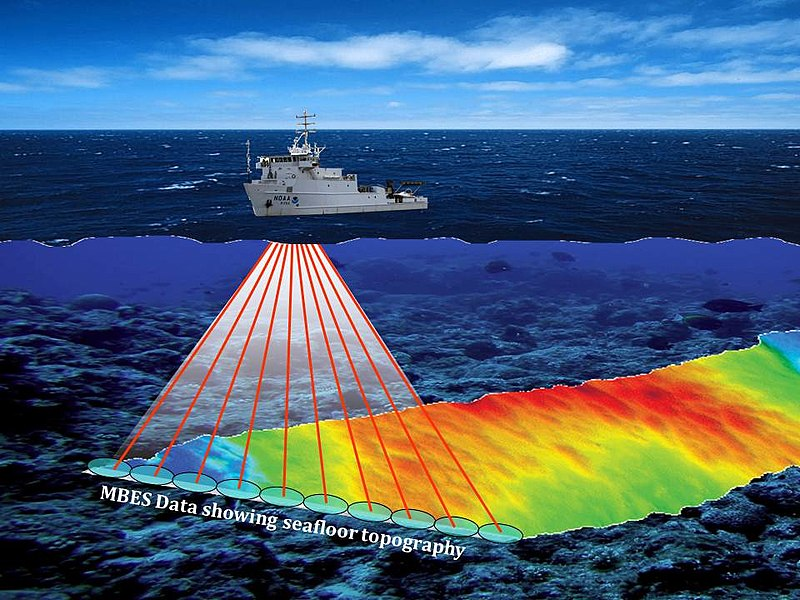
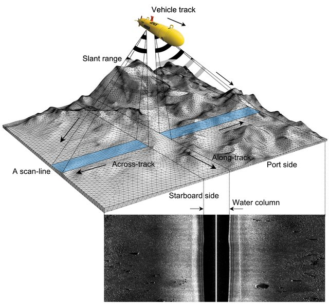
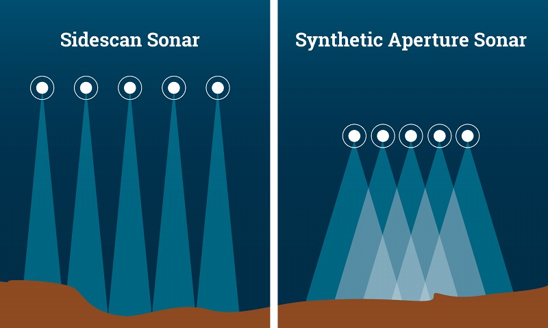
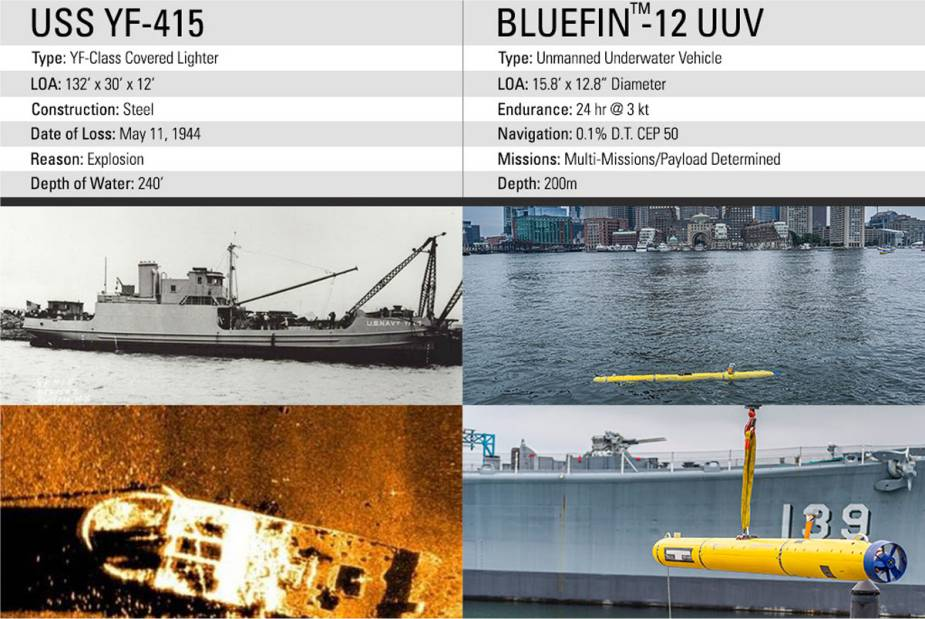
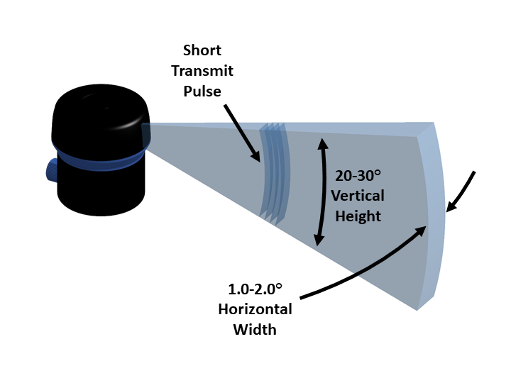
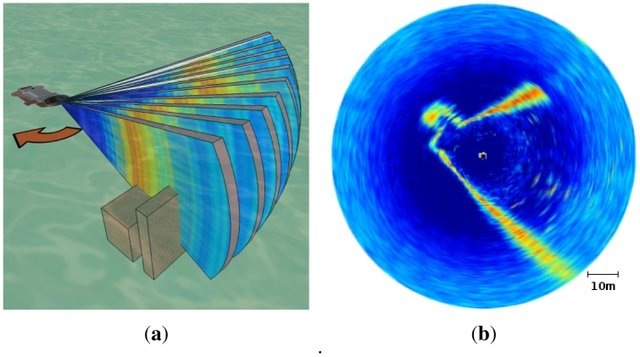
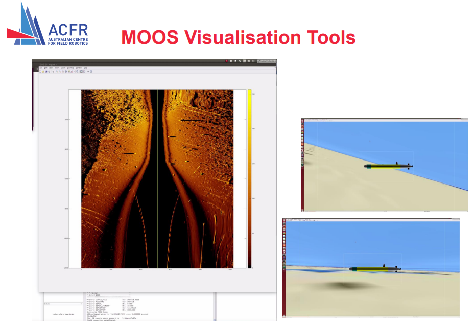
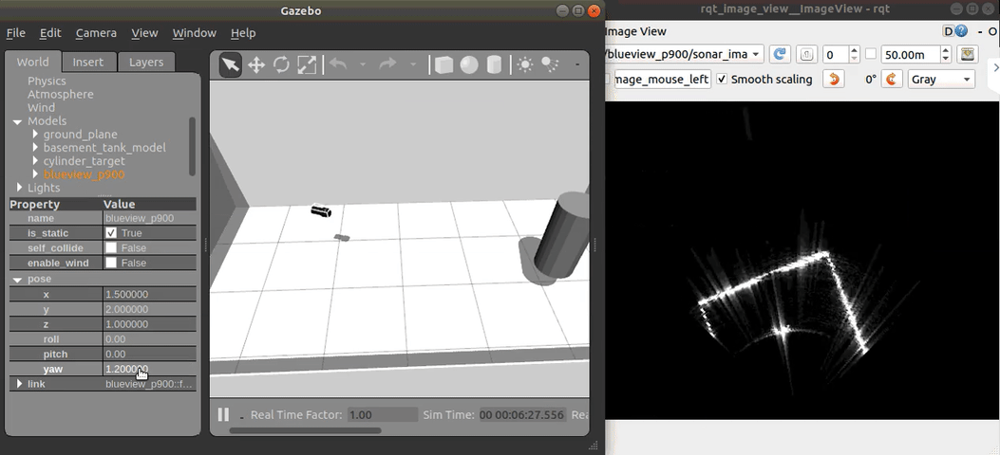

# Literature Review

## Introduction

Military forces are increasingly using autonomous Underwater Vehicles (AUVs) to acquire high-resolution sonar imagery to detect mines and other objects of interest on the seabed. Automatic detection and classification techniques are being developed for several reasons: to provide reliable and consistent detection of objects on the seabed, free
human analysts from time-consuming and tedious detection tasks, and enable autonomous
in-field decision-making based on observations of mines and other objects. This document
reviews progress in developing automated detection and classification techniques for
side-looking sonars mounted on AUVs. Whilst the techniques have not yet reached maturity,
considerable progress has been made in both unsupervised and supervised (trained)
algorithms for feature detection and classification. In some cases, the performance and
reliability of automated detection systems exceed those of human operators.

<div id="fig:echo-sounder-location-australia">
  

Locations of echo-sounds data used for ocean floor mapping near Australia [@smith1996_ShipTrac]

</div>

Acoustic devices are widely adopted for a systematic survey of the ocean basin. For example, the ocean's depth can usually be measured by acoustic echosounders on ships or satellite altimeters data.

Oceanographic and naval ships have operated echo sounders almost continuously while at sea, which facilitate millions of miles of ship-track data recorded to
produce maps.
The tracks are not well distributed and tend to cluster in regions that are high in traffic, such as commercial shipping routes.
@fig:echo-sounder-location-australia illustrates an example of the echosounder data used for mapping the ocean floor near Australia.

### Structure

This literature is structured as follows.
We will begin by covering some background information about the principle in @sec:background and the typical usage of Sonar in underwater vehicles.
Then, in @sec:terminology we provide a list of common terminologies used in maritime application to familiarise the readers on technical terms used throughout the article.
In @sec:technologies we review several common types of sonar technologies used in modern UAVs.
We provide a review of sonar datasets in @sec:dataset, followed by a brief description of several commercial sonar data format in @sec:format.
Then, @sec:sim provides a list of simulators that can simulate sonar sensors and finish the article in @sec:ml with a brief review on the existing classification model for underwater operation.


## Background Information  {#sec:background}

Sonar (**SO**ound **N**avigation **A**nd **R**anging) and Radar (**RA**dio **D**etection **A**nd **R**anging) are two systems that operates under the same principle but with different types of wave.
Both systems are established to estimate the position of some foreign objects using waves [@altes1979_TargPosi].
Sonar uses ultrasound for detection underwater, whereas Radar uses radio waves for above the land or underwater detection.


* Sonar uses sound propagation for navigation, communication, or detecting objects under the water surface. The term "sonar" is shared by two different technologies---_passive sonar_ and _active sonar_. @fig:passive-and-active-sonar illustrates an overview between the two systems.

  * **Passive Sonar** signal processing performs time delay estimation for naval systems [@carter1981_TimeDela]. Signals received at two or more receiving sensors are used to estimate the position and velocity of some detected acoustic source. While a passive system has the advantage of covertness for military applications, its practicality is highly subjected to background noise as it cannot control the amount of transmitted energy reflected from the source. For example, @howell2003_PassSona and @deseixas2011_PrepPass utilise sensor data retrieved from passive sonar systems for performing object detections with neural networks.


<div id="fig:passive-and-active-sonar">
  

  Passive and active sonar system [@kuperman2014_UndeAcou]. **Passive:** submarine (right) passively detects sounds using a towed antenna array. The other submarine will receive machine noise on the left (blue) and surface shipping noise (red). These sounds are distorted by the shallow-water environment and are embedded in ocean surface noise (green). **Active:** ship on the right sends out a pulse (red) and receives an echo (blue), regardless of machine noise, which is in turn distorted by the shallow-water environment. The echo is returned to the ship, which needs to be distinguished from backscattered reverberation (yellow) and ocean noise (green)
</div>

## Characteristic of Sonarr

### Variability of the Speed of Sound {#sec:sonar-speed}

The ocean's acoustic properties mainly depend on the sound speed structure, which depends on the oceanographic environment.
When a sound wave travels along a path from some localised source, the combination of the water column and bottom properties leads to a set of sound-propagation profiles [@medwin1999_FundAcou].
Sound speed profile in the ocean water column has been experimentally derived [@mackenzie1981_NineEqua;@munk1998_AbysReci] as

$$1994$${#eq:speed-of-sound-profile}

```
$$ C = 1448.96 + 4.591T − 0.05304T^2 + 0.0002374T^ 3 + 0.0160Z + (1.340 − 0.01025 T)(S − 35) + 1.675 \times 10^{−7} Z^2 − 7.139 \times 10^{−13} T Z^3 $$
```

where $C$ is the speed of sound in $m/s$, $T$ is the temperature in Celsius, $S$ is salinity, and Z is depth in meters (which characterises the ambient pressure).
Note that the precise formulation details are not of interest here in our scope.
However, [@eq:speed-of-sound-profile] illustrates the nonlinear relationship between the water temperature and the depth of the acoustic device.
In fact, the polynomial model illustrates up to a third-order expression _wrt_ $T$ and $Z$.
@fig:speed-profile visualises the same plotted data across ocean depth.
For typical oceanic conditions, $C$ is usually between 1450 m/s and 1550 m/s, which reflects the sensitivity of $C$ to changes in temperature, depth, and salinity.
It is indicative that near-surface sonar devices will tend to experience higher variance inaccuracy due to the polar region near the ocean surface; the polar relationship decays as the depth increases.
In a warmer season, or warmer part of the day, the increased temperature causes sound speed increases toward the sea surface (hence, the influence of $C$ is dominated by the temperature of the water); whereas the pressure term in @eq:speed-of-sound-profile is more significant in deeper water.
These are potential factors to be considered in simulating sonar data for ML modelling, where the environmental factors might be essential conditional features for our ML model to learn.

<div id="fig:speed-profile">
  

  Generic sound-speed profiles vary directly with temperature and hydrostatic pressure [@kuperman2014_UndeAcou].
  Near-surface mixing leads to isovelocity (the gap in between the curves, which denotes the polar region)
</div>


### Terminology {#sec:terminology}

* Frequency:
  * Different frequencies are typically used to map different water depths, with higher frequencies (>100kHz) used for shallow water and low frequencies (<30 kHz) for deepwater (see @fig:frequency-ocean-depth).
  * There is also a trade-off in resolution, with higher frequency shallow water systems providing greater spatial resolution than lower frequency deep-water systems
  * Low-frequency (<200kHz) Sonar has a long-range imaging capability. However, they are inherent in low resolution, reducing the ability to discriminate between smallscale features.
  * Conversely, high-frequency (>200kHz) imaging sonar generates high-resolution datasets, providing greater detail and improving data analysis [@thurman2009_MultInte]
  * The typical frequency usage at different depths are summarised in @tbl:sonar-frequency.

<div id="fig:frequency-ocean-depth">
  

  Classess of ocean depth, corresponds to @tbl:sonar-frequency  [@thurman2009_MultInte]
</div>

* Resolution:
  * Refers to the ability to distinguish between two closely spaced objects.
  * A resolution cell is the minimum volume cell that can be seen by the Sonar separately from the surrounding features. An object might be represented as a single detected patch if the object is smaller than the cell's resolution.
  * The smaller the cells are, the better the resolution and the closer the sonar image is to reality.
  * Cell size is defined by (i) Beam and (ii) Range Resolution.

* Beam:
  * A beam is a spatial and angular area where the acoustic energy is concentrated. As with a flashlight or projector, the beam is similar to a light cone.
  * The angular size of the cone is usually referred to as the "beam width", whereas the cross-section is often referred to as "beam footprint"

* Range Resolution defines the resolution cell in 3D space, i.e., resolution along the beam axis. The resolution, in turn, depends on (i) Ping Structure and (ii) Bandwidth.
  * _Ping Structure_: includes the ping length (seconds), the central frequency (kHz) and the bandwidth (in kHz), unless the ping is a single-frequency (pure tonal) signal.
    * The shorter the ping, the smaller the range resolution cell is (characterised by the central frequency).
  * _bandwidth_: Generally, lower bandwidth provides better resolution. However, the Chirp spread spectrum can be used to modulate and obtain a better resolution than resolution.

* _Attenuation_:  the acoustic energy loss in the water. The longer the propagation path, the more energy is lost. A higher frequency will also induce more loss in the water medium.

* _Multi-Path Propagation_:  In shallow water, the sound is reflected by both the ocean bottom and surface.
  * When operating an acoustic device over a sizeable horizontal range (much more significant than water depth), the echo can hit boundaries multiple times (known as _multi-bounce_) while propagating.
  * The sound reflected by the target object can propagate in many different acoustic rays with different kinds of bounces, which makes it harder to analyse the target objects' distance.
  * The typical maximum horizontal range is at about 10 to 12 water depths.

|                       | Water Depth | Operating Frequencies | Resolution    | Swath Coverage | Remarks                                            |
| :-------------------- | :---------- | :-------------------- | :------------ | :------------- | :------------------------------------------------- |
| Shallow Water Systems | < 100m      | > 200kHz              | Medium - High | Low - Medium   | Continental shelf, in shore-water seabed surveying |
| Deep Water Systems    | > 200m      | < 200kHz              | Low           | High           | Wide-area, deep ocean seabed surveying             |
| ROV/AUV Systems       | 5m – 4000m  | 200kHz – 500kHz       | High          | Low            | Detailed, high resolution seabed surveying         |

: Comparison of typical operating specifications for sonar systems {#tbl:sonar-frequency}

 Other parts of the multi-beam system include auxiliary sensors such as motion-sensing systems and Global Positioning Systems (GPS) to ensure accurate positioning, motion sensing and sound speed measurement system.

A modern multi-beam sonar transducer typically uses the Mills Cross array. The sound is transmitted from transducers that are perpendicular to the survey track. Consequently, the sound pulses form a wide transmit swath across and narrow along-track. The returning sound pulses, which mainly record the impedance contrast and seafloor topography, are received by the receivers mounted parallel to the survey track. These return beams are narrow across the track. Unlike the sidescan Sonar, which commonly produces only acoustic backscatter data (i.e. hardness), the multi-beam Sonar generates both water depth and seafloor hardness data concurrently.
[@geoscienceaustralia2014_MultSona].

Optical vision provides high-resolution images for recognising underwater environments with high accuracy in clear waters. However, optical vision has a limitation in its visibilities, especially in turbid or deep waters.
Therefore, acoustic devices whose visibilities are not heavily dependent on the depth of water and turbidness have high reliability in the underwater environment.

* Forward-Looking Sonar (FLS) imagery can be used for fish finding, scanning past objects, and differentiating between bottom structures and topography with high definition imagery for ship sailing. @fig:fls illustrates a typical FLS device used in ships and the sonar output that such a device provides.


<div id="fig:fls">
  
  

  Forward-looking sonar (FLS) and example outputs [@beaumont2021_ForwSona]
</div>


## Ascoustic and Sonar Technologies {#sec:technologies}

High attenuation of electromagnetic waves underwater reduces the usability of video or Radar in maritime applications in the subsea environment. Instead, acoustic waves are typically the only practical way to chart broad areas of the seafloor and its typological features.
Sonar technology has been successfully employed to record our ocean seabeds' composition, physical attributes, and habitat and community patterns of the maritime ecosystem.
In the following, we will systematically list out and review the numerous acoustic devices currently available.
These systems differ in their acoustic mapping techniques and capabilities.

### Single-beam echosounders (SBES)

Single-beam echosounders, also known as a depth sounder or fathometer, releases a single sound pulse in a narrow beam and "listen" for the return echo.
The sonar ping is emitted from a transducer positioned below the water surface, and the return echo might be reflected by anything ranging from fish, debris, aquatic vegetation, suspended sediment, or the ocean seafloor. SBES can be dated back to 1925 for the first Fathometer (built by the Submarine Signal Company). They can be  relative portable nowadays as shown in @fig:single-beam-echo-sounder-product

<div id="fig:single-beam-echo-sounder-product">
  

  Single-beam echosounders as commercial products for boats [@ceehydrosystemsSingBeam]
</div>

### Multi-Beam Sonars (MBS)

The Multi-Beam Sonars (MBS), or sometimes referred as Multibeam echosounders (MBES), samples a region of the sea bottom by emitting ultrasonic waves
in an fan shape. The distance to the closest obstacles within their field of view is obtained using Time of Flight (TOF) techniques, thus computing the water depth. In contrast to other sonars,
directional information from the returning sound waves is extracted using beamforming [@vanveen1988_BeamVers], so that a
swath of depth readings is obtained from every single ping. This behaviour constitutes the MBS main
advantage, as well as their most distinctive feature: contrarily to the previously mentioned sonars,
MBS provide true 3D information of the ocean floor and, thus, they are commonly used to obtain
subsea bathymetry.

Multibeam Sonar is a standard offshore surveying tool that uses multiple sound signals to detect seafloors (see @fig:multi-beam-sonar). The use of multiple beams allows it to map a swath of the seabed under the ship (in contrast to a single beam sonar which only maps a single point). Generally, the multi-beam sonar transducer is mounted rigidly to the hull of the survey vessel, and its position can be calculated very accurately [@geoscienceaustralia2014_MultSona].
Compared to SBES, Multibeam echosounder emits a multidirectional radial beam to obtain information within a fan-shaped swath (see @fig:multi-beam-sonar), and they are typically used for bottom profiling.
The timing and direction of the returning sound waves provide detailed information on the depth of water and any underwater features.
@fig:single-multibeam-echosunder illustrates the qualitative differences between collecting data with an SBES and MBES

<div id="fig:multi-beam-sonar">
  

  Multibeam sonar for seafloor mapping [@noaaphotolibrary2016_ArtiConc]
</div>

* **Multibeam echosunds mapping system (MBMS)** is an integration of several components: (i) the MBES, and (ii) an inertial navigation system (INS), (iii) a data-collection and (iv) a data-processing computer.
Since MBES collects data by scanning the seafloor with multiple beams, the reconstructions of the mapping information require combining the collected depth information and the angles/timing at which the data are collected.

<div id="fig:single-multibeam-echosunder">
  

  Example of a single beam (top) and multi-beam echosounder
(bottom) output [@usgs2018_HydrSurv]
</div>

### Side Scan Sonar (SSS)

Side Scan Sonar (SSS) [@sternlicht2017_HistDeve] provides echo intensity profiles in the maritime environment [@savini2011_SideSona]. Spatial resolution of SSS is usually below that of SAS and since they are not mounted on
a rotating platform, they do not provide 360◦ views of the environment but slices of the seafloor [@burguera2016_HighUnde].
Moreover, they do not provide true bathymetry like MBS. Despite these limitations, when compared
to SAS or MSIS, SSS are still the sensor of choice to obtain seafloor imagery, and they will probably
remain shortly for two main reasons.

SSS are economical, thus being suitable even in low-cost robotics. Moreover, they are particularly easy to deploy. They do not require any special mounting such as MBS or
MSIS and they are even available as a towfish so they can be used without any additional infrastructure
in some AUV and Remotely Operated Vehicles (ROV), as well as in ships ([@fig:SSS]). Also, their power consumption
is below that of SAS, MSIS and MBS, thus being well suited in underwater robotics where the power
tends to be a problem.

<div id="fig:SSS">
  

  Principle of a side-scan sonar mounted on an autonomous underwater vehicle [@lehoang2020_DeepGabo]
</div>

The most common application of SSS is to produce acoustic images of the sea bottom, which are
analysed offline by humans. These images make it possible to detect some geological features [@johnson1990_GeolInte]
or to explore and analyse archaeological sites [@bava-de-camargo2015_UseSide], among others, but mainly involving human
analysis of the SSS data. Unfortunately, SSS imagery has not been traditionally used to perform
autonomous navigation since the obtained acoustic images have some particularities that jeopardise
their automatic analysis.

For example, since SSS measurements are slices of the sea bottom usually perpendicular to
the motion direction, they do not overlap between them and, thus, they provide no information to estimate the AUV motion directly. Also, similarly to other sonars, SSS unevenly ensonify the targets,
thus leading to echoes that depend not only on the structure of the sea bottom but also on the
particular ensonification pattern. Moreover, since the hydrophone and the ultrasonic emitter are
very close, the acoustic shadows, which correspond to occluded areas, strongly depend on the AUV
position concerning the target. This means that the same target leads to very different acoustic
images depending on its position relative to the AUV. Finally, raw SSS images are geometrically
distorted representations of the sea bottom [@cobra1992_GeomDist] and properly correcting this distortion is a complex
task [@sheffer2018_GeomCorr].

### Synthetic Aperture Sonar (SAS)

Synthetic Aperture Sonar (SAS) [@edgar2011_IntrSynt] gathers several measurements of each spot and fuses them during post-processing, which producer high-resolution echo intensity profiles ([@fig:sas-figure]). SAS is capable of
scanning the sea bottom with resolutions at the orders of magnitude better than other sonars systems.
However, using SAS constrains the maximum speed at which the AUV can move since the same spot has to
be observed several times. Moreover, this high resolution depends on the AUV
moving in straight trajectories since observing the same spot from different angles may jeopardise
the post-processing. Moreover, SAS is particularly expensive, and their deployment is more complex
than other types of Sonar.

SAS is an enhancement from the standard, narrow beamwidth, sidescan Sonar; capable of producing a more faithful, optical-like "image" of the seafloor. The image intensity represents the backscattered acoustic energy from a specific direction.


<div id="fig:sas-figure">
  

  With side scan sonar (left), each pulse measures a distinct, separate area of the seafloor. In contrast, the pulses of synthetic aperture sonar (right) overlap with each other and measure each area more than once. This artificially lengthens the reach of the array [@noaaExplTool]
</div>

SAS's image is an intensity representation of
the backscattered acoustic energy from a specific range, depression, and aspect angle. With a standard side-looking sonar,
each ping echo return is processed independently and the
main problem with the image is that the along-track resolution
(sometimes called azimuth resolution) becomes poorer as the
range increases. Synthetic aperture techniques use coherent
addition over many pings to create an aperture whose extent
can be increased with range to maintain a constant along-track
resolution.

### Multi Aperture Sonar (MAS)

Multi Aperture Sonar (MAS) functions like a top-performing traditional side-scan sonar, but it is processed very differently.
MAS uses multi-beam input from 32 elements to dynamically extend the focus along the whole length of the swath. Using multiple apertures, the data is further enhanced, and the Signal-to-noise Ratio is improved.
Compared to SAS, MAS addresses the AUV's Weight And Power (SWAP) budget issues.
MAS draws only low 21 Watts (including data acquisition) – which makes it equivalent to the class leading AUV side-scan sonars – but it offers a range and accuracy like no other side-scan sonar. The precision of the Sonar over the initial 50 meter swath is as stunning as the leading SAS systems. At 75 meter range, the precision is better than two times that of the closest side-scan Sonar [@sonardyne2017_MASVs].

<div id="fig:MAS">
  

  UUV Operators Collect New, Clear Images from 76-year-old Shipwreck with a Bluefin-12 equipped with Sonardyne Solstice Multi Aperture Sonar at Sea Trials for the Royal Australian [@navyrecognition2020_SolsMult]
</div>

### Mechanically Scanned Imaging Sonar (MSIS)

The most distinctive
feature of Mechanically Scanned Imaging Sonar (MSIS) [@ribas2010_UndeMech] is its rotating sensing head which provides 360◦
echo intensity profiles of the environment.
Therefore, this sensor is used to detect and map obstacles in the plane where the AUV navigates,
though a few studies exist showing their use to scan the sea bottom [@sena2018_ShalWate]. The main drawback
of this sensor is, precisely, the mechanical rotation, which is responsible for very large scan times,
usually between 10 and 20 seconds and also leads to high power consumption. This also constrains
the speed at which the AUV can move since moving at high speed would lead to distorted scans.
Additionally, installing an MSIS on an AUV is not simple as they have a preferential mounting
orientation. @fig:msis-1 illustrates the typical device and @fig:msis2 shows the visualisation of the sensor output.

<div id="fig:msis-1">
  

  Typical fan shaped beam used on scanning sonars [@blueroboticsUndeUsin]
</div>

<div id="fig:msis2">
  

  Scanning process of an MSIS. (a) The two boxes represent obstacles in the acoustic wave path; (b) Example of acoustic image. The colors depict the echo intensities, ranging from blue (low echo intensity) to red (high echo intensity). [@burguera2012_UspIPerf]
</div>


## Sonar file format {#sec:format}

We are able to obtain some form of sonar data under the `.JSF` file format from our defence partner. `.JSF` is a proprietary file format developed by **EdgeTech** [@edgetech2006_DescEdge] for their manufactured sonar system. The [referenced manual](https://www3.mbari.org/data/mbsystem/formatdoc/JSF_format_Rev17.pdf) contains the specification of how to parses the binary format. However, the file format does not seem widespread among AUV systems (or perhaps the question should likely be whether there is a standardised format at all).

Specialised software can render the captured sonar scans into a 3D format with meshing, for example, [@sonarwizEdgeJSF] and [@mogasoftwareSeaVMOSA]. However, both options require a commercial license to operate. We also found some legacy software [@deepvisionSonaSoft] from 2010 that had failed to install,

Some open-source software can also perform some limited preliminary reads on `JSF` files. For example, [this package](https://github.com/Geosvy/jsfmesgtype) [@obrien2019_Geos] enable users to count the number of messages types within the `JSF` container, and [this](https://github.com/Geosvy/lstjsf) [@obrien2018_Geos] allows the user to list the contents of an Edgetech Sonar data file. However, the capability to reconstruct the scene remains only available in commercial products.

### Types of existing format

Unfortunately, there does not seem to have any open standard format for recording sonar data. Vendors seem to develop their proprietary form of format whenever they put resources into developing their sonar devices. Based on an indirect source of information from  SonarWiz [@sonarwizSonaSide] (a software for post-processing survey data), they claimed that their software could support more than 25 formats, where each format belongs to some Manufacture.
@tbl:sonarwiz-supported list out all Sidescan Sonar Data file formats supported by the software, along with their corresponding manufacturer (`JSF` is only one type of format out of the bigger picture) [@SideSona].

| Manufacturer / Format Name               | Format Extension   |
| ---------------------------------------- | ------------------ |
| C-MAX                                    | XTF, CM2           |
| CODA                                     | COD                |
| Edgetech                                 | JSF                |
| eXtended Triton Format                   | XTF                |
| Geoacoustics                             | GCF, RDF, RFF      |
| Humminbird side-view                     | DAT                |
| HYPACK                                   | HSX                |
| Imagenix Sportscan                       | 81S                |
| Imagenix Yellowfin                       | 872                |
| Imagenix Delta T Backscatter             | 83P                |
| Innomar SS                               | SES                |
| Klein                                    | SDF                |
| Kongsberg EM backscatter                 | ALL, KMALL         |
| Kongsberg (Simrad) EA400/600 Backscatter | RAW                |
| Kongsberg (ProSAS, HI SAS 1030)          | IMG, XTF           |
| Kongsberg (PULSAR SS)                    | XTF, SMB           |
| KRAKEN                                   | TIL                |
| Lowrance                                 | XTF, SL2, SL3      |
| Marine Sonic                             | MST, SDS           |
| MCM Sensor HD                            | H5                 |
| QMips                                    | DAT, QMP           |
| QPS                                      | QPD, DB            |
| R2Sonic                                  | R2S, XTF           |
| RESON                                    | S7K                |
| Seabeam2100 (MBSystem)                   | MB41               |
| Sonardyne Solstice                       | SWF8               |
| SwathPlus (Bathyswath)                   | SXR, SXP           |
| Swedish Geo Survey                       | SEG, SGY           |
| Tritech                                  | V4Log, LogDoc, XTF |

: Comparison of typical operating specifications for sonar systems {#tbl:sonarwiz-supported}

## Sonar visualisation and simulation {#sec:sim}

@cerqueira2016_CustShad implements custom shaders for efficient Sonar simulation.
The underwater sonar sensors are simulated by vertex and fragment processing, composed of the integration between
the Gazebo simulator and the Robot Construction Kit (ROCK)
framework. They can be used for virtual acoustic images from a **mechanical scanning sonar** and **forward-looking sonar** simulations.

<div id="fig:gazebo-cerqueira2016_CustShad">
  

  Gazebo simulator with custom shaders [@cerqueira2016_CustShad]
</div>

@nikolov1997_Inte3D describe a new software system
for interactive three-dimensional visualisation of
sonar data. Novel approaches to 3-D volumetric sonar data reconstruction and segmentation
are presented. VRML worlds are generated from
the segmented data with the aim of quick and
interactive 3-D visualisation and interpretation
of the sea.

<div id="fig:3D-vis">
  

  3-D segmentation, surface extraction, texture mapping and data fusion [@nikolov1997_Inte3D]
</div>

@kwak2015_DeveAcou proposed a principles of acoustic natures and imaging geometry model of the acoustic camera
which greatly contribute to developing a simulator for the acoustic
images ([@fig:kwak2015_DeveAcou-vis]).
The technique can generate realistic virtual acoustic images based on
the proposed principles.

<div id="fig:kwak2015_DeveAcou-vis">
  

   Comparison of acoustic images and optical images: (a) acoustic image
of cone, (b) acoustic image of cylinder, (c) optical image of cone, and
(d) optical image of cylinder [@kwak2015_DeveAcou]
</div>

### Existing packages for sonar simulation

* [MOOS](https://sites.google.com/site/moossoftware/): MOOS stands for "Mission Oriented Operating Suite" and its original use was for the Bluefin Odyssey III vehicle owned by MIT [@newman2008_MOOSMiss]. MOOS is an autonomy middleware that implies that it is a glue that connects a collection of applications. MOOS can be used to generate scans such as the one used in @fig:moos-acfr from the ACFR group [@anderson2015_SimuSide].

* [MOOS-IvP](https://oceanai.mit.edu/moos-ivp/pmwiki/pmwiki.php?n=Main.HomePage): According to MOOS-IvP's [manual](https://oceanai.mit.edu/moos-ivp-pdf/moosivp-helm.pdf) [@benjaminOverMOOS], MOOS-IvP is an improved framework based upon MOOS, where the IvP Helm is a single MOOS process theat uses multi-objective optimisation to implement behaviour coordination. The IvP refers to "Interval Programming, " the core mathematical concept for performing multi-objective optimisation.

* [MOOS-ROS-bridge](https://github.com/SyllogismRXS/moos-ros-bridge): [@demarco2021_Moos] ROS is a more sophisticated framework for robotics application; however, MOSS is a more specialised middleware for maritime application [@demarco2011_ImplROS]. This package enables user to create a communication bridge between the two.

* [Sonar-simulator-blender](https://github.com/sollynoay/Sonar-simulator-blender): A 2D forward looking sonar simulator built in Blender. It can generates acoustic image via a backscattered intensity image and a depth image.


<div id="fig:moos-acfr">
  

  MOOS virualisation tool [@anderson2015_SimuSide]
</div>

* [Imaging sonar simulator](https://github.com/romulogcerqueira/sonar_simulation): This repository contains the build system of imaging sonar simulator + partly data [@cerqueiraCustShad;@cerqueira2020_RastRayt], for:
  * Mechanical scanning imaging sonar (MSIS)
  * Forward-looking sonar (FLS)

* [UUV Simulator](https://github.com/uuvsimulator/): @manhaes2016_UUVSimu introduces an Unmanned Underwater Vehicle (UUV) Simulator, as an extension of the open-source robotics simulator Gazebo to underwater scenarios, that can simulate multiple underwater robots and intervention tasks using robotic manipulators. The simulator implements a set of newly
implemented plugins that model underwater hydrostatic and
hydrodynamic effects, thrusters, sensors, and external disturbances (@fig:UUV-sim). In contrast to existing solutions, it reuses and extends a general-purpose robotics simulation platform to underwater environments. [Link](https://uuvsimulator.github.io/)

<div id="fig:UUV-sim">
  

  UUV Simulator - Software structure [@manhaes2016_UUVSimu]
</div>

* [Waterloo-Aquadrone](https://github.com/Waterloo-Aquadrone/aquadrone-core/): @waterlooaquadrone2021_Aqua2020, a team from Waterloo Aquadrone, releases a workspace for developing a fully autonomous submarine.

* [Inpinite Studio](https://infinitestudio.software/) is a using unreal engine for performing multispectral simulations.
The software allows users to customise the modelling properties; for example, materials are defined using actual data for spectral reflectivity, emissivity, transmission, and roughness. In-band thermal emissions can be evaluated by spectral integration. It currently supports lighting, transmissions and secondary effects from refections.
Qualitative evaluation of the simulated results can be performed by comparing them against experimental results that we would expect from physical scenarios. @fig:infinite-studio illustrates the interface of the infinite studio within unreal engine's software.

<div id="fig:infinite-studio">
  

  Inpinite Studio's interfacs
</div>


* [Dave](https://github.com/Field-Robotics-Lab/dave/): Dave is a simulation environment to support the rapid testing and evaluation of underwater robotic solutions, specifically underwater vehicles (AUVs/UUVs).
@@manhaes2016_UUVSimu presents a physics-based multi-beam echosounder simulation method to capture these fundamental aspects of sonar perception. A point-based scattering model is implemented to calculate the acoustic interaction between the target and the environment @fig:dave. This simplified target scattering representation but can produce realistic coherent image speckle and the correct point spread function. The results demonstrate that this multi-beam echosounder simulator generates qualitatively realistic images with high efficiency to provide the sonar image and the physical time-series signal data.

<div id="fig:dave">
  

  Operating with the Dave Simulator [@field-robotics-labMultForw]
</div>


## Maritime Dataset {#sec:dataset}

* @mallios2017_UndeCave seems to be a high-quality underwater cave dataset published recently in The International Journal of Robotic Research on Underwater caves sonar data set. The dataset features a collection from an autonomous underwater vehicle testbed in the unstructured environment of an underwater cave complex. The dataset contains a packaged ROS bag (Robotic Operation System) and human-readable text files. The UAV contains multiple sensors such as 3D gyroscopes, accelerometers, 10 degrees of freedom MEMS inertial sensor, a Doppler velocity log, etc. The perception sensors include a mechanically scanned imaging sonar (MSIS), a dual-frequency profiling sonar, and a low-cost analog video camera. @fig:ijrr-dataset illustrate the UAV and its survey location; the dataset is available [here](https://cirs.udg.edu/caves-dataset/).

<div id="fig:ijrr-dataset">
  
  

  Underwater cave dataset: UAV model and its survey location [@mallios2017_UndeCave]
</div>


## Underwater Classification {#sec:ml}

Detection/ classification routines can broadly be divided into two kinds: the operation of
supervised and unsupervised algorithms. Supervised algorithms can be trained for
the required detection task using images representing the clutter backgrounds
likely to be encountered, providing flexibility to cope with both straightforward and difficult
detection tasks [@chappleAutoDete]. Supervised algorithms require training data to set
up their operation; unsupervised algOrithms do not.

While supervised algorithms can be expected to perform better when there is a training data
set appropriate for the test data (the data in which unknown mines must be detected), the task
of obtaining an appropriate training data set is non-trivial. There must be mine-like objects in
known locations, so that valid detections and false alarms can be identified, and the
background clutter and reverberations should be typical and representative of those in the test
data. There should also be enough training data so that anomalies in particular training
images do not affect the overall detection performance. Training with data sets including
atypical backgrounds and reverberations can impair the performance of a trained
algorithm; it is better to restrict the training data to contain only typical backgrounds
and representative of those encountered in the detection task at hand.

<div id="fig:data-preprocess">
  

  Example of intensity and slant corrected acoustic image. The blind zone and the
central bins, separating port and starboard, are outlined. The blind and low contrast zones under
constant altitude and flat floor assumptions are also shown. [@burguera2020_OnLiMult]
</div>


@burguera2020_OnLiMult proposed an online multi-class segmentation for side-scan sonar acoustic data for building a semantic map of the sea bottom for SLAM. The authors first propose an architecture of pre-processing the input data ([@fig:data-preprocess]). Then, a data segmentation procedure is then applied to the processed data to detect the existing
terrain types. They propose to perform online SSS segmentation based on a CNN with a sliding window, with the CNN architecture as shown in @fig:sonar-cnn-seg, and the data-processing step shown in @fig:data-seg-processing-step.

<div id="fig:sonar-cnn-seg">
  

  Neural Network architecture [@burguera2020_OnLiMult]
</div>

<div id="fig:data-seg-processing-step">
  

  Example of data processing. (a,b): Modelled echo intensity E(p) according to Equation (5).
(c,d): Raw SSS data. (e,f): Intensity and slant corrected acoustic image. [@burguera2020_OnLiMult]
</div>

@karimanzira2020_ObjeDete developed a generalised
underwater object detection solution based on Automated Machine Learning with R-CNN.
The trained simple object detector was then used for automatic data collection and annotating
a large dataset. @fig:auto-annotate is some predictions from the primitive model, which illustrate the benefits of
the methodology for automated data annotation.

<div id="fig:auto-annotate">
  

  In (a) two annotations are correctly suggested, and one is missed, which should be labelled
manually. In (b) this image would take a long time to annotate manually. The primitive model has
done a reasonable job of cutting out the bulk of the workload [@karimanzira2020_ObjeDete]
</div>

@hurtos2013_AutoDete proposed a framework for automatic chain detection in underwater environment ([@fig:chain-detection]). The automatic chain link detection from Forward-Looking Sonar (FLS) imagery reduces the signal-to-noise ratio of the individual sonar frames, and cluster the local detections over time to increase robustness ([@fig:chain-detection-2]).

<div id="fig:chain-detection">
  

  Schematic of the link detection algorithm [@hurtos2013_AutoDete]
</div>

<div id="fig:chain-detection-2">
  

  Example of established clusters (circled in white) after the accumulation of detections over a buffer of 9 images [@hurtos2013_AutoDete]
</div>


## References
